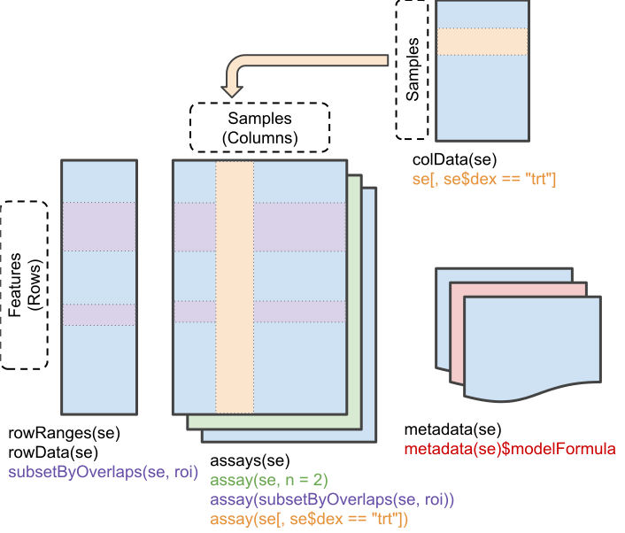

# Introduction

The goal of this presentation is provide the audience with the tools to make a simple
Bioconductor package.

## Why would you want to do that?

Bioconductor is a very active community of developers on the cutting edge of genomic data analysis, and such, Bioconductor packages form the basis for a high impact ecosystem. Beyond that, Bioconductor packages typically synthesize well, and by becoming part of the community, you may find your work and impact magnified as packages and workflows are built based on your contributions. This is more true now than ever thanks to the partnership with f1000 research https://f1000research.com/gateways/bioconductor .

# Before we begin

Before you begin to make a package, there are some things to consider.

1. What do I want the package to do?
2. What resources are there already to help achieve my goals?
3. What data do I want to include?
4. What data structures already exists related to my project?
5. What quality control and reproducibility elements can I include in the package?

# Initial considerations

Typically, you want to make a package because you have a method, data, or tool that others will find useful. Personally, my packages typically start from a vignette. Analysis can often be an excersize in problem solving, and when you are finished, you may find out that your process itself is worthy of being a product.

It is highly reccomended that developers check for existing packages related to the topic. BiocViews is a great place to check https://www.bioconductor.org/packages/release/BiocViews.html . Checking for existing work is also a great way to conceptualize how your package will fit into the ecosystem.

# Data

Bioconductor packages make use of data in wide variety of formats.

1. If your data is large (Bioconductor software packages are limited to 5mb), you might want to create a Bioconductor data package like breastCancerUPP which provides gene cancer expression data https://www.bioconductor.org/packages/release/data/experiment/html/breastCancerUPP.html
2. If you want to distribute whole genome resources, you might consider AnnotationHub http://bioconductor.org/packages/release/bioc/html/AnnotationHub.html
3. Experimental data can be stored in ExperimentHub  https://bioconductor.org/packages/release/bioc/html/ExperimentHub.html
4. Data can be served via api's such as REST using tools like swagger https://swagger.io/
5. HDF5 data can be shared using services like the HDF Scalable Data Service at http://www.hdfgroup.org and accessed using tools like http://bioconductor.org/packages/release/bioc/html/rhdf5client.html
6. Data can be shared in Amazon web services S3 buckets and Google Big Query https://cran.r-project.org/web/packages/bigQueryR/vignettes/bigQueryR.html
7. Data can be shared in databases such as MySQL, Oracle, MongoDB, etc and accessed via tools you can find here https://cran.r-project.org/web/views/Databases.html

If your data is small, then you can include the data directly in your package.

## Basic data prep

Data can come in variety of formats, and R has excellent tools to get data into a useable state.

1. Excel documents can be exported to csvs and read into R as data frames. Make sure to check for warnings and import errors due to incomplete lines, make sure the missing data specifier is correct, and verify the dimensions of the data match what you expect.
2. XML and html tables can be read into R using the XML package. https://cran.r-project.org/web/packages/XML/index.html Make sure that the data does not contain unusual characters and only coerce xml trees to data frames when you are sure they are truely rectangular.
3. Web based data can be accessed using packages like httr https://cran.r-project.org/web/packages/httr/index.html and rjson https://cran.r-project.org/web/packages/rjson/index.html

## Bioconductor Objects

Many Bioconductor packages make use of core data objects such as:

1. GenomicRanges https://www.bioconductor.org/packages/release/bioc/html/GenomicRanges.html
2. SummarizedExperiments http://www.bioconductor.org/packages/release/bioc/html/SummarizedExperiment.html
3. MultiAssayExperiments http://bioconductor.org/packages/release/bioc/html/MultiAssayExperiment.html
4. SingleCellExperiments http://bioconductor.org/packages/release/bioc/html/SingleCellExperiment.html

### GenomicRanges

GenomicRanges are the primary way of storing information on ranged genomic data. GenomicRanges extend IRanges to create an efficient way to store, query, find overlaps between sets of annotated genomic ranges.

Borrowing the example from http://bioconductor.org/packages/release/bioc/vignettes/GenomicRanges/inst/doc/GenomicRangesIntroduction.html

```{r granges}
suppressPackageStartupMessages({library(GenomicRanges)})
gr <- GRanges(
    seqnames = Rle(c("chr1", "chr2", "chr1", "chr3"), c(1, 3, 2, 4)),
    ranges = IRanges(101:110, end = 111:120, names = head(letters, 10)),
    score = 1:10,
    GC = seq(1, 0, length=10))
gr
```

Here is an example of a small GenomicRange object that contains 10 ranges and some data.

If you split this range into 2.

```{r granges2}
gr1=gr[c(1,3,5,7,9),]
gr2=gr[c(2,4,6,8,10),]
gr1
gr2
```

We can get the overlapping regions with findOverlaps

```{r granges3}
ov=findOverlaps(gr1,gr2)
ov
```

Here we see that the first range in gr1 overlaps with the third range in gr2.


### SummarizedExperiments

SummarizedExperiments (and RangedSummarizedExperiments) are the defacto way to store rectangular experimental data such as sequencing and microrarray data.

Looking at: http://www.bioconductor.org/packages/release/bioc/vignettes/SummarizedExperiment/inst/doc/SummarizedExperiment.html



A summarized experiment is constructed with information on features as rows and samples as columns. Multiple assays can be stored in a single experiment along with experiment level metadata and sample level data. SummarizedExperiments can be easily subsetted and filtered while preserving the stucture and metadata.

### MultiAssayExperiments

MultiAssayExperiments extend SummarizedExperiments and excels at representing multiomic data where the dimensions of the assays are not the same.

### SingleCellExperiments

SingleCellExperiments are used to store data from single cell experiments.

Looking atthe example here:  http://bioconductor.org/packages/release/bioc/vignettes/SingleCellExperiment/inst/doc/intro.html

```{r sce1}
suppressPackageStartupMessages({library(SingleCellExperiment)})
counts <- matrix(rpois(100, lambda = 10), ncol=10, nrow=10)
sce <- SingleCellExperiment(assays = list(counts = counts))
sce
```

This is a basic SingleCellExperiment. SingleCellExperiments can be used to store information on the assays along with spikein information, metadata, and even reduced dimensional data such as from PCA and TISNE clusters.

# Creating your own objects S3,S4, and Reference Classes

Using core Bioconductor classes make your package easier to integrate with existing methods and tools, but sometimes there is not a class that you need for your work. In that case there are a few options for creating objects and methods from scratch.

1. S3 - The simplest representation framework for objects. https://www.datamentor.io/r-programming/s3-class/
2. S4 - More formalized classes https://www.datamentor.io/r-programming/s4-class/
3. Refence classes and R6 allow for the creation of mutable objects and allow for pass by reference methods https://r6.r-lib.org/articles/Introduction.html

## S3 Classes

### Overview

S3 classes are the simplest objects in R. They are basically lists with an additional property.

Most internal R objects are S3 classes. For example, a linear model has class "lm":

```{r s30}
mod=lm(mpg~wt, data=mtcars)
class(mod)
str(mod)
```

### Construction

We can construct or own classes and objects using lists as well.

```{r s3}
myCard=list(suit="heart",value=10)
class(myCard)="card"
myCard

createCard<-function(suit,value){
  if(!(value%in%c(2:10,"jack","king","queen","ace"))|!(suit %in% c("diamond","heart","club","spade"))){stop("Not a Valid Card")}
  myCard=list(suit=suit,value=value)
  class(myCard)="card"
  return(myCard)
}

myCard2=createCard("diamond","king")
myCard2
```

Here we construct a card with a suit and a value, then write a small constructor to make card objects from their data.

### Methods

Now that we have an object, we can write methods for it. Note: S3 methods are named using the convention generic.class

For example, the method "plot" is a generic and lots of objects have their own defined plot method.

```{r s32}
methods(plot)
```

So when you plot a linear model with class "lm" plot.lm will be called.

If we want to write our own print method for cards, we just need to name it print.card.

For example:

```{r s33}
print.card<-function(card){
  print(paste0(card$value," of ",card$suit, "s"))
}

myCard2

```

### Generics

We can write our own generic functions as well if we want to have a method to respond differently to different object classes.

## S4 classes

### Overview

S4 is more structured that S3, and S4 is less prone to errors due to increased validity checking. Many Bioconductor objects such as SingleCellExperiments are S4 Classes.

```{r s40}
sce
isS4(sce)
str(sce)
```

### Construction

S4 classes are defined by a name and a list of slots with defined data types.

For example, our card example would be defined as:

```{r s4}

setClass("card",slots=list(suit="character",value="character"))

```
A new instance of the object is created using the function "new"

```{r s42}
mycard3=new("card",suit="club",value="5")
mycard3
```

Note: The value 5 has to be in quotes because we need a character as defined by our class.

In S3 internals are accessed with "$", in S4 slots are accessed wuth "@"

```{r s43}
mycard3@suit
```

### Methods

Methods for S4 Objects are created using the setMethod function.

For example, to recreate our print method for the card, we can create our own "show" method for the card class.

```{r s44}
setMethod("show","card",
  function(object){
    print(paste0(object@value," of ",object@suit, "s"))
  }
)

mycard3
```

### Additional resources

These are great resources:

1. https://kasperdanielhansen.github.io/genbioconductor/html/R_S4.html#s3-and-s4-classes
2. https://www.bioconductor.org/packages/release/bioc/vignettes/S4Vectors/inst/doc/S4QuickOverview.pdf
3. https://www.bioconductor.org/help/course-materials/2010/AdvancedR/S4InBioconductor.pdf

## R6

### Overview

R6 classes are the newest object classes that are in wide use. They allow for private and public methods and data as well as pass by reference operations. So basically, you can modify them in place which makes some tasks like recursive directory mapping much easier. They require the R6 package to create and use.

### Construction

R6 objects are constructed using a syntax similar to S3 and S4.

For example, our card would be defined

```{r r6}
library(R6)
card=R6Class(
  "card",
  public=list(
    suit=NULL,
    value=NULL,
    show=function(){
      print(paste0(self$value," of ",self$suit, "s"))
    },
    initialize = function(suit = NA, value = value) {
     self$suit <- suit
     self$value <- value
     self$show()
   },
    changeToAce=function(){self$value="ace"}
  )
)

mycard4=card$new("spade","7")
```

Here the public list shows data and methods that are available to all. The show function is an example of how the class can get information about itself using "self". The initialize function details how to create an instance of the object and what to do afterwards. Here we have it run the "show" method when it is done. Finally, the changeToAce function modifies the value of the "value" field in place when called. Note that the functions in the class are accesssed using "$".

```{r r64}
mycard4
mycard4$changeToAce()
mycard4
```

# Reproducibility

Finally, some notes about reproducibility.

## Documentation

All functions, data, objects and methods should be documented with Roxygen2 or similar.

## Testing

Whenever possible, functions and data should be covered by unit tests. The covr package can help document the level of coverage in your package.

## Web based data testing

Data spot checks should cover a tiling of the data. Be careful not to only check the first few observations. Also, make sure to have your unit tests fail gracefully if the data resource is not available, otherwise your package may fail checks because someone is restarting a machine.

### Checksums

The md5sum function in the tools package provides an easy way to get file checksums. If you have a checksum for your raw data, your program, and your output, you can be confident that your workflow produced your results.

### BiocFileCache

BiocFileCache is a great tool for keeping track of data resources. https://bioconductor.org/packages/release/bioc/html/BiocFileCache.html
