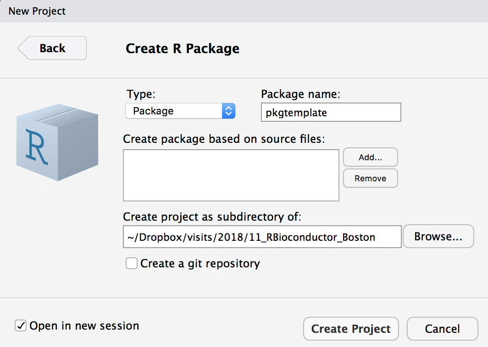
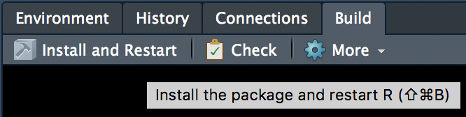
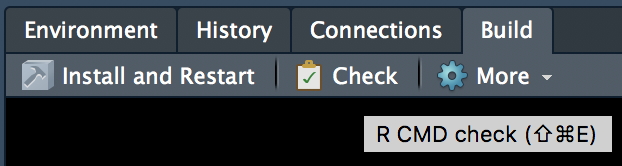

```{r setup, include=FALSE}
knitr::opts_chunk$set(echo = TRUE, fig.align = "center")
library(tidyverse)
```

## References for building R packages

_R packages_ by Hadley Wickam

    - Book freely available at http://r-pkgs.had.co.nz

_Writing R Extentions_ by the R Core Team

    - https://cran.r-project.org/doc/manuals/r-release/R-exts.html

## Getting started

We will use a few packages that help in the task of creating and developing R packages.

R packages can be authored without any of these tools, but they make life a little bit easier.

```{r eval=FALSE}
install.packages(c("devtools", "roxygen2", "testthat"))
```

- `devtools` helps with all aspects of building and installing packages

- `roxygen2` streamlines writing documentation for your code

- `testthat` streamlines writing unit tests for your code

## Requirements for a package name

There are three formal requirements: 

- the name can only consist of letters, numbers and periods, i.e., .

- it must start with a letter.

- it cannot end with a period. This means you can’t use either hyphens or underscores, i.e., - or _, in your package name. 

- Tip! : recommend against using periods in package names because it has confusing connotations (i.e., file extension or S3 method).


## Example package: `pkgtemplate`

In order to learn about package development, we will use an example package that implements simple calculation.


## Creating a package

There are two ways to create the package. 

1. You can use RStudio: 

R studio > File > new project > new directory > R package > then,

{ width=70% }\

Explore the directories that are created by running of both functions.

## Creating a template

2. `devtools` and base R provide us with two ways of creating a template for a new package.

```{r eval=FALSE}
library(devtools)
devtools::create("pkgtemplate1")
```

```{r eval=FALSE}
package.skeleton("pkgtemplate2")
```

Using `devtools::create()` is slightly more minimalist, but it still creates some files that are helpful but not strictly necessary.


## Package structure

An R package is really just a directory with certain required files and subdirectories. The directory layout of an R package is:

- `PACKAGE_NAME/`
    + `DESCRIPTION` : A structured description of the package
    + `NAMESPACE` : Imports package dependencies and exports your functions and classes
    + `R/` : All your R code lives here
    + `man/` : Documentation of exported R functions and classes
    + `src/` : Compiled code (C, C++, Fortran, etc.) lives here
    + `inst/` : Miscellaneous files to move into the package directory when installed
    + `data/` : `.RData` or `.rda` data files used by the package
    + `tests/` : Unit tests for the package's functions and classes
    + `vignettes/` : Vignettes illustrating the package's use
    + `NEWS` : Changelog for the package

Many of these directories are optional.

## Package structure (cont'd)

- `PACKAGE_NAME/`
    + `DESCRIPTION` : A structured description of the package
    + `NAMESPACE` : Imports package dependencies and exports your functions and classes
    + `R/` : All your R code lives here
    + `man/` : Documentation of exported R functions and classes

R will build and install a package with only the DESCRIPTION file and `R/` subdirectory. However, the minimal requirements for a proper package also include a NAMESPACE file and ".Rd" documentation in the `man/` subdirectory for all exported functions and classes.

All of these can be created by hand. However, some tools exist that can generate some of these automatically.

## Tools for automation

- `devtools`

    - Build, check, and install packages from within R
    
    - Offers convenience functions for adding common development infrastructure to a package
    
        - `devtools::document()` for `roxygen2::roxygenize()`
        
        - `devtools::use_testthat()` for adding `testthat` infrastructure template
        
        - `devtools::use_vignette()` for adding a R Markdown vignette template.
        
        - `devtools::use_rcpp()` for Rcpp infrastructure template, etc.
    
- `roxygen2`

    - Inspired by `doxygen` documentation generator for C++, Java, Python, etc.

    - Automatically generate R documentation from structured code comments
    
    - Automatically generate NAMESPACE file from structured code comments
    
    - Will discuss more when discussing `man/` and `NAMESPACE`
    
- `testthat`

    - R package that provides convenience functions for writing unit tests
    
    - Other such packages exist for the same purpose, such as `RUnit`
    
    - Will discuss more when discussing `tests/`


## Code (`R/`) : organize your functions

This subdirectory contains all of your R code in `.R` scripts. You may arrange your code into as many or as few scripts as you like, but it is a good idea to be organized.

- don’t put all functions into one file and don’t put each function into its own separate file. (It’s OK if some files only contain one function, particularly if the function is large or has a lot of documentation.). File names should be meaningful and end in .R.

- Pay attention to capitalization, since you, or some of your collaborators, might be using an operating system with a case-insensitive file system (e.g., Microsoft Windows or OS X). Avoid problems by never using filenames that differ only in capitalisation.

- if I can’t remember the name of the file where a function lives, I need to either separate the functions into more files or give the file a better name. Unfortunately you can’t use subdirectories inside R/. The next best thing is to use a common prefix, e.g., abc-*.R.

## Code (`R/`) : organize your functions (cont'd)

```{r eval=FALSE}
# Good
fit_models.R
utility_functions.R

# Bad
foo.r
stuff.r
```


## Code (`R/`) : code style
- The following guide describes the style that I use (in this book and elsewhere). It is based on Google’s R style guide. (https://google.github.io/styleguide/Rguide.xml)

- recommend that you use a consistent style 

- Your code will usually have multiple readers. If you’re writing code with others, it’s a good idea to agree on a common style up-front. 


## Code (`R/`) : object names 

- Variable and function names should be lowercase. 
- Use an underscore (_) to separate words within a name (reserve . for S3 methods). 
- Generally, variable names should be nouns and function names should be verbs.

```{r eval=FALSE}
# Good
day_one
day_1

# Bad
first_day_of_the_month
DayOne
dayone
djm1
```

## Code (`R/`) : object names (cont'd)

- Where possible, avoid using names of existing functions and variables. 
```{r eval=FALSE}
T <- FALSE
c <- 10
mean <- function(x) sum(x)
```

## Code (`R/`) : spacing

- Place spaces around all infix operators (=, +, -, <-, etc.). 

- The same rule applies when using = in function calls. 

- Always put a space after a comma, and never before (just like in regular English).

```{r eval=FALSE}
# Good
average <- mean(feet / 12 + inches, na.rm = TRUE)

# Bad
average<-mean(feet/12+inches,na.rm=TRUE)
```

## Code (`R/`) : spacing (cont'd)

- There’s a small exception to this rule: :, :: and ::: don’t need spaces around them.
```{r eval=FALSE}
# Good
x <- 1:10
base::get

# Bad
x <- 1 : 10
base :: get
```

## Code (`R/`) : spacing (cont'd)

- Place a space before left parentheses, except in a function call.

\scriptsize
```{r eval=FALSE}
# Good
if (debug) do(x)
plot(x, y)

# Bad
if(debug)do(x)
plot (x, y)
```
\normalsize

- Do not place spaces around code in parentheses or square brackets (unless there’s a comma, in which case see above).

\scriptsize
```{r eval=FALSE}
# Good
if (debug) do(x)
diamonds[5, ]

# Bad
if ( debug ) do(x)  # No spaces around debug
x[1,]   # Needs a space after the comma
x[1 ,]  # Space goes after comma not before
```
\normalsize

## Code (`R/`) : Curly braces
An opening curly brace should never go on its own line and should always be followed by a new line. A closing curly brace should always go on its own line, unless it’s followed by else.

Always indent the code inside curly braces.

\scriptsize
```{r eval=FALSE}
# Good
if (y < 0 && debug) {
  message("Y is negative")
}

if (y == 0) {
  log(x)
} else {
  y ^ x
}

# Bad
if (y < 0 && debug)
message("Y is negative")

if (y == 0) {
  log(x)
} 
else {
  y ^ x
}
```
\normalsize

## Code (`R/`) : assignment
- Use <-, not =, for assignment.

```{r eval=FALSE}
# Good
x <- 5

# Bad
x = 5
```

## Code (`R/`) : line length

- Strive to limit your code to 80 characters per line. 

- This fits comfortably on a printed page with a reasonably sized font. 

- Indentation : some recommends to use two spaces. Bioconductor recommends to use 'tabs' (4 spaces).  Can change these options in the code preferences pane of R studio.

## Code (`R/`) : make two new functions
```{r eval=FALSE}
hello_wname <- function(name) {
    print(paste0("Hello, ", name, "!"))
}

add <- function(x, y) {
    x + y
}
```

## Package metadata (`DESCRIPTION`)

The DESCRIPTION file lists various attributes of the package, including:

\footnotesize

```{}
Package: The name of the package
Title: A more descriptive name of the package
Version: ?.?.?
Author: Who authored the package
Maintainer: Who currently maintains the package
Description: A longer-form description of the package functionality
Depends: A list of packages that must be loaded and attached
Imports: A list of packages that must be loaded but are not attached
Suggests: A list of packages used by tests, vignettes, etc.,
          but are not needed for the package to function
License: A legal license (e.g., GPL, MIT, etc.)
```
\normalsize

## The description file for the `pkgtemplate` package

\footnotesize

```{}
Package: pkgtemplate
Type: Package
Title: An Example Package for simple functions
Version: 0.1.0
Author: Meena Choi
Maintainer: Meena Choi <m.choi@northeastern.edu>
Description: pkgtemplate is an example package illustrating
			several R concepts for building packages.
License: Artistic-2.0
Encoding: UTF-8
LazyData: true
RoxygenNote: 6.0.1
Suggests: knitr,
    rmarkdown,
    testthat
VignetteBuilder: knitr
```
\normalsize

## Documentation (`man/`)

This directory includes all of the documentation for the package and R objects (including functions, methods, class definitions, and datasets).

It is written in `.Rd` files which are based on `LaTeX`.

These files can be authored by hand, but we will use the package `roxygen2` which allows us to keep our documentation with our code by using code comments. Similar to `doxygen`, `roxygen2` generates the documentation for us from structured code comments that we put near the function we want to document.

## Documenting a function

\tiny
```{r eval=FALSE}
#' Print Hello and name
#'
#' Print Hello and name together.
#'
#' @param name name to call.
#' @return print Hello and name
#' @examples
#' hello_wname("Meena")
#'
#' @export

hello_wname <- function(name) {
    print(paste0("Hello, ", name, "!"))
}

#' Add together two numbers.
#'
#' @param x A number.
#' @param y A number.
#' @return The sum of \code{x} and \code{y}.
#' @examples
#' add(1, 1)
#' add(10, 1)
#' @export
add <- function(x, y) {
    x + y
}
```
\normalsize

## Documenting the package

\scriptsize
```{r eval=FALSE}
#' pkgtemplate: An Example Package for printing Hello.
#'
#' pkgtemplate is an example package illustrating
#' several R concepts for building packages.
#'
#' @docType package
#' @name pkgtemplate-package
#'
NULL
```
\normalsize

## Generating documentation from roxygen

- Pressing Ctrl/Cmd + Shift + D will generate a man/add.Rd

- Call `roxygen2::roxygenize()` or `devtools::document()` to generate the `.Rd` files in the `man/` subdirectory from the code comments.

```{r eval=FALSE}
roxygen2::roxygenize("pkgtemplate")
```

```{r eval=FALSE}
devtools::document("pkgtemplate")
```

Then, check `man/` subdirectory. The `.Rd` files for package and functions will be available.

## Namespace (`NAMESPACE`)

The namespace uses directives such as `import()` and `export()` to specify any R objects to import from other packages, and which to export to the user.

- `import` makes all functions in a package available to your package

- `importFrom` selectively imports functions for use from another package

- `export` exports any R object such as functions to be available to the user and other packages

- `S3method` exports S3 methods

- `exportClasses` exports S4 classes

- `exportMethods` exports S4 methods

## The generated namespace for `pkgtemplate`

\small
```{r eval=FALSE}
# Generated by roxygen2: do not edit by hand

export(add)
export(hello)
export(hello_wname)
```
\normalsize

## Vignettes (`vignettes/`)

Vignettes are (typically) R Markdown files that are compiled when the package is built.

You can add a template for a vignette using:

```{r eval=FALSE}
devtools::use_vignette("pkgtemplate")
```

This will:

- Create a vignettes/ directory.

- Add the necessary dependencies to DESCRIPTION (i.e. it adds knitr to the Suggests and VignetteBuilder fields).

- Draft a vignette, vignettes/my-vignette.Rmd.

Once you have this file, the workflow is straightforward:

- Modify the vignette.

- Press Ctrl/Cmd + Shift + K (or click ) to knit the vignette and preview the output.


## Unit tests (`tests/`)

Unit tests are used to test small, reproducible snippets of code to confirm they do what they say they do. You don't need to use any additional packages for this, but using a package such as `testthat` or `RUnit` make writing unit tests a bit easier.

You can create a template for writing unit tests with `testthat` by running:

```{r eval=FALSE}
devtools::use_testthat(pkg="pkgtemplate")
```

## The `testthat.R` file for `pkgtemplate`

```{r eval=FALSE}
library(testthat)
library(ProtExp)

test_check("pkgtemplate")
```

## The `testthat/test-pkgtemplate.R` file for `pkgtemplate`

```{r eval=FALSE}
require(testthat)

context("pkgtemplate")

test_that("add function works", {

	expect_equal(add(1, 4), 5)

})
```

## Building a package

Building the package makes a bundled package out of a source package. This allows for easier distribution, and is the preferred input for checking and installing packages from the command line. You can build a package from the command line or from R.

{ width=70% }\

`R CMD build` takes a source package as input.

```{}
R CMD build pkgtemplate
```

`devtools::build()` takes a source package as input.

```{r eval=FALSE}
devtools::build("pkgtemplate")
```

## Checking a package

Checking a package looks for common code errors, checks the documentation, checks that the package can be loaded smoothly, and makes sure any examples or unit tests run without error. For CRAN or Bioconductor to accept a package, it must pass `R CMD check` without errors or warnings. Checking a package is best done on a bundled package, and can be done from the command line or in R.

{ width=70% }\

`R CMD check` takes a bundled (or source) package as input.

```{}
R CMD check pkgtemplate_0.1.0.tar.gz
```

`devtools::check()` takes a source package as input.

```{r eval=FALSE}
devtools::check("pkgtemplate")
```

## Installing a source package

To use the package in R, it must be installed. This can be done from the command line or in R. Installing a package is the only part of building/checking/installing packages that can be done from R without `devtools` (unless you use the `system()` function).

`R CMD INSTALL` takes a bundled (or source or binary) package as input.

```{}
R CMD INSTALL pkgtemplate_0.1.0.tar.gz
```

`install.packages` takes a variety of argument types.

\small
```{r eval=FALSE}
install.packages("pkgtemplate_0.1.0.tar.gz", repos=NULL, type="source")
```
\normalsize

`devtools::install()` takes a source package as input.

\small
```{r eval=FALSE}
devtools::install("pkgtemplate")
```
\normalsize

## Data (`data/`)

This data simply includes any data (saved as `.Rdata` or `.rda` using the `save()` or `saveRDS()` functions.

When the package is loaded, this data is not automatically loaded. Instead, they are loaded on-demand using `data()`.

Any datasets included in a package must also be documented. They can be documented using `roxygen2` similarly to functions.

## Installed files (`inst/`)

Any files in this directory are moved to the top-level directory when the package is installed.

This might be useful for:

- Data that is not in `.Rdata` or `.rda` format, such as CSV files

- Additional documentation

- Scripts for non-compiled langauges that the package uses like Python

## Compiled code (`src/`)

This is the directory for any C, C++, or FORTRAN compiled code that the package uses.

## Build R package, next meetup

- GitHub

- good Vignette

- BiocCheck

- Submitt to Bioconductor

- Github for Bioconductor

- etc.

## May Institute 2019

\

