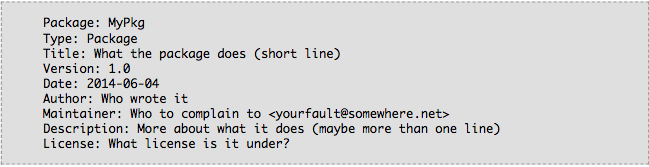
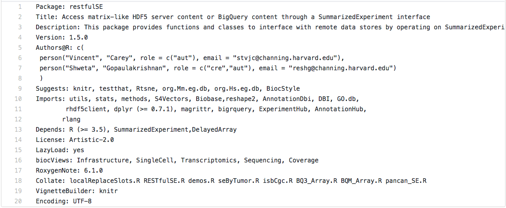
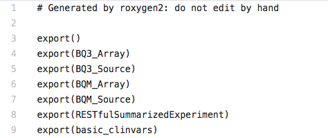
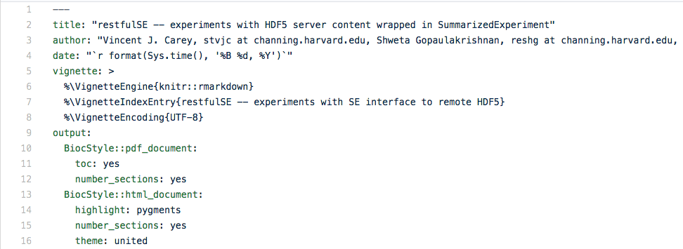
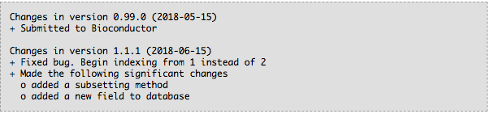
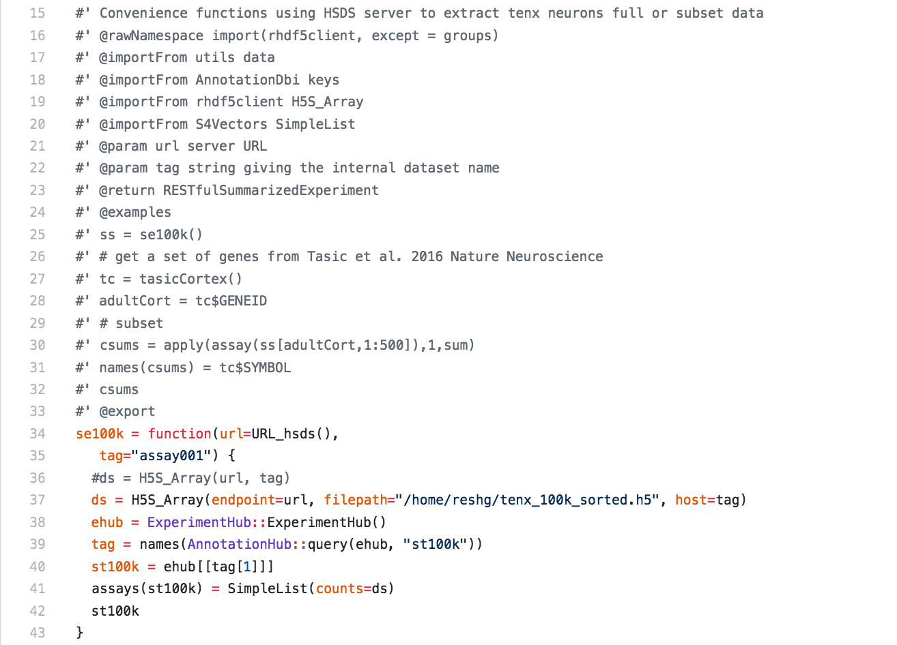
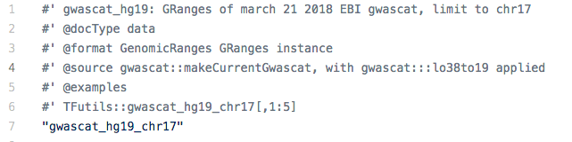
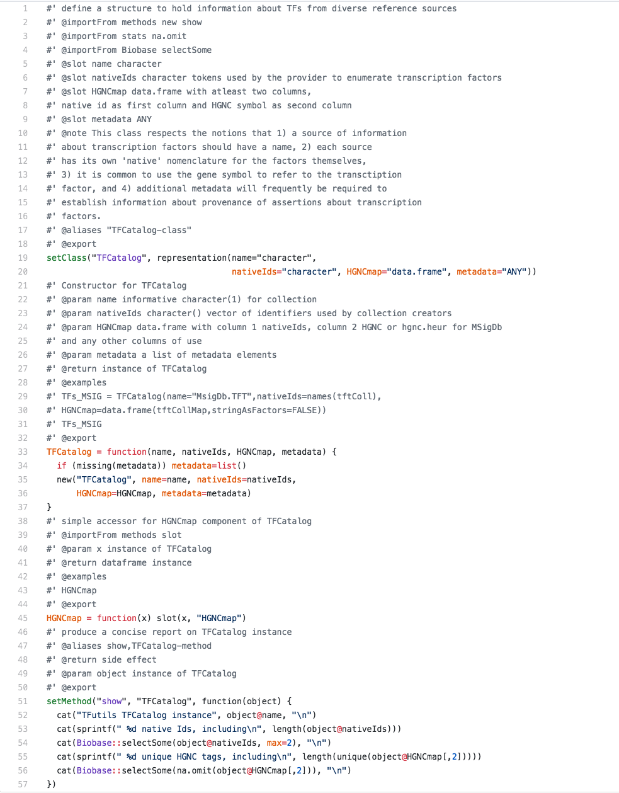
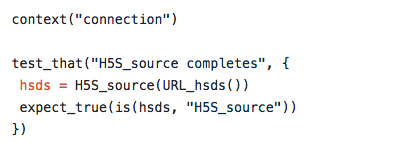
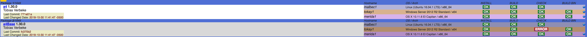

# Code organization
# Making an R package

- A package is just a directory with specific files and directory structure.

- The easiest way to create a new package is using either R studio or devtools.

## R Studio

1. Click File then "New Project"
2. Select "New Directory"
3. Select "R Package"
4. Give it a name and a location

## Devtools

The devtools package contains a function called "create()"

create("mypack") will create a package structure called mypack in your current directory

# What is in a package

# Skeleton 

Here's a brief overview of how an R package looks : 

- DESCRIPTION : To store important metadata about your package.

- NAMESPACE : Defines the functions, classes, and methods that are imported into the name space, and exported for users. 

- NEWS : Keeps track of changes to the code from one version to the next.

- CITATION : Appropriate citations must be included in help pages and vignettes; this aspect of documentation is no different from any scientific endeavor.

- Data Directory [Including Data] : The data directory is where data lives. It should be in .rda, .csv, or similar.

- R directory : The R directory is where R code goes. The files should end in .R

- Package Documentation:
  1. Man directory : 
     This is where documentation for your package goes. It should have .rd files. We will use roxygen2 to generate these later.
  2. Vignettes directory : 
     The vignettes directory is where you put example rmarkdown files that will be compiled when the package is installed.

- Inst directory : 
  1. The inst directory can contain anything. In my projects, I include a subdirectory called "dataprep". 
  2. This directory contains all of the raw data (if possible), code to transform the data (both R and other), and session               information/checksums of all files.
  
- Unit Tests 

- .gitignore : Bioconductor requires a git repository for submission.

Here is a link to get more information : https://bioconductor.org/developers/how-to/buildingPackagesForBioc/

## DESCRIPTION 

 - The description file contains information about the package. 
 - There are fields for title, description, author, maintainer, version, dependencies and more.
 - Rstudio creates a basic DESCRIPTION file that would look like this : 
   
 - For a Bioconductor package, we add a few more fields like :  
 1. Depends - List the packages your package depends on. If you have another package and your package is really meant to be used along with that package then you might want to list it here.
 2. Imports - This is what you should use when you want to access the contents of another package from within the code of your own package.
 3. Suggests - This is for dependencies that are not needed in order to load and use your package. 
 4. Collate - List the ‘.R’ source files here in the order that you want them to load and R will do so.
 5. BiocViews - To describe a package in Bioconductor using a controlled vocabulary, for example if your package works with Single Cell Sequencing data, it is safe to mention "SingleCell" as a                  BiocView. 
 - Below is an example of a DESCRIPTION file from a Bioconductor package "restfulSE" 
 [ https://bioconductor.org/packages/release/bioc/html/restfulSE.html ]
  

## Version Numbering 
- Bioconductor packages need the version numbers in x.y.z format. 
= Bioconductor has a ‘devel’ branch where new features are introduced, and release branches created twice per year. 
- Given a package with version number x.y.z,
     y should be an odd number in devel.
     y should be an even number in release. 
- During the development of a package, authors increment the z version of the package by 1 for each GIT commit. 

## NAMESPACE 
  - The namespace file contains regular expressions noting what functions/objects should be attached when the package is loaded. 
  - This is to prevent shadowing whenever possible.
  - Below is an example of a NAMESPACE file from a Bioconductor package "restfulSE" 
 [ https://bioconductor.org/packages/release/bioc/html/restfulSE.html ]

  

## Vignette 
- Below is an example of a NAMESPACE file from a Bioconductor package "restfulSE" 
 [ https://bioconductor.org/packages/release/bioc/html/restfulSE.html ]
   

- For more information : https://bioconductor.org/packages/release/bioc/vignettes/BiocStyle/inst/doc/LatexStyle2.pdf

## NEWS
  - Example of a NEWS file from 
  

# Roxygen

## Why do we need documentation? 

- Documentation is one of the most important aspects of a good package. 
- Without it, users won’t know how to use your package. 
- Documentation is also useful for future-you (so you remember what your functions were supposed to do), and for developers extending your package. 

## How to use Roxygen ? 

- Add roxygen comments [start with #'] to your .R files.

- Run devtools::document() (or roxygen2::roxygenise()) to convert roxygen comments to .Rd files. (devtools::document() calls roxygen2::roxygenise() to do the hard work.)

- Roxygen will also create a NAMESPACE for you, and will manage the Collate field in DESCRIPTION. 

## Documenting Functions 
- Basic tags: 
  1. @param name description : Inputs to the function, description mentions the type of the parameter.(e.g. string, numeric vector)
  2. @examples : Provide executable code to show how to use your function.
  3. @return description : Describes the output from the function. 
- Below is an example of documenting a function using Roxygen from a Bioconductor package "restfulSE" 
 [ https://bioconductor.org/packages/release/bioc/html/restfulSE.html ]
 

## Documenting datasets
- Basic tags:
 1. @format : Gives an overview of the structure of the dataset.
 2. @source : Where you got the data from (like a \url{}).
- Below is an example of documenting a dataset using Roxygen from a Bioconductor package "restfulSE" 
 [ https://bioconductor.org/packages/release/bioc/html/restfulSE.html ]
 

## Documenting classes, generics and methods
- Basic tags:
  1. @slot: Document the slots of the class.
- Below is an example of documenting a S4 class and method using Roxygen from a Bioconductor package "restfulSE" 
 [ https://bioconductor.org/packages/release/bioc/html/restfulSE.html ]
 

# Unit Tests

- Testing is a vital part of package development. 
- It ensures that your code does what you want it to do. 
- RUnit or testthat packages to write unit tests.

Guide : http://bioconductor.org/developers/how-to/unitTesting-guidelines/

# Testthat

## Testthat is a package for testing R code.

- You use it to write code to test R functions and objects and make sure that they are performing as you expect.
- The old way of doing testing... Most people used to interactively test code in the console or use print statements to make sure that things were working as expected. 
                                  Ideally people would use R functions like stopifnot()

## Example 
- Below is an example of a test from a Bioconductor package "restfulSE" 
 [ https://bioconductor.org/packages/release/bioc/html/restfulSE.html ]
 

## Test Coverage 

- Test coverage refers to the percentage of your package code that is tested by your unit tests. 
- Packages with higher coverage have a lower chance of containing bugs.

## Now, lets create a simple Package

Go to an appropriate directory

library(devtools)

create("BioCMeetup")

setwd("BioCMeetup")

## Now update the package

Update the DESCRIPTION file

1. Fix the author field
2. Fix the version
3. Add a Maintainer: name \<email\>
4. Update Description

## Now load Testthat

library(testthat)

use_testthat()

or

devtools::use_testthat()

## What does this do?

It:

1. Adds testthat to suggests in the DESCRIPTION
2. Adds a direction structure in tests/

## Test format:

from http://r-pkgs.had.co.nz/tests.html

test_that("str_length is number of characters", {
  expect_equal(str_length("a"), 1)
  expect_equal(str_length("ab"), 2)
  expect_equal(str_length("abc"), 3)
})

## Run tests

Tests are run with test() or as part of R CMD check

## Run R CMD CHECK and BiocCheck on the package 

## Glance at Bioconductor's build/check results : 
- https://www.bioconductor.org/checkResults/3.8/bioc-LATEST/
 

# References 

1. https://cran.r-project.org/web/packages/qwraps2/vignettes/create_pkg.html
2. http://r-pkgs.had.co.nz/
3. https://www.bioconductor.org/developers/package-guidelines/#unittest
4. https://bioconductor.org/developers/how-to/version-numbering/
5. https://www.bioconductor.org/help/package-vignettes/
6. https://bioconductor.org/packages/release/bioc/vignettes/BiocStyle/inst/doc/LatexStyle2.pdf

